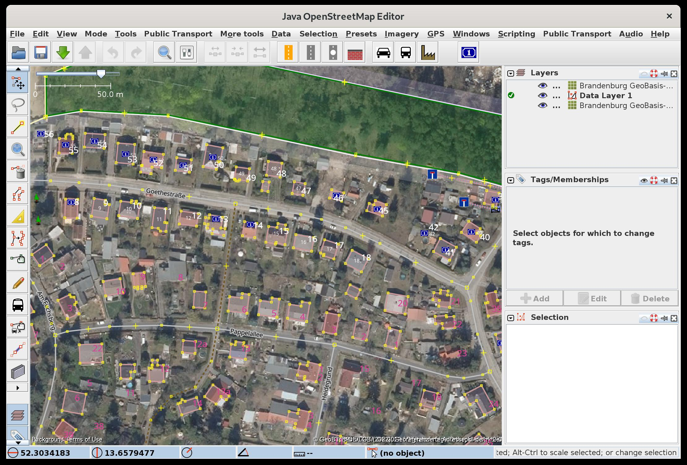
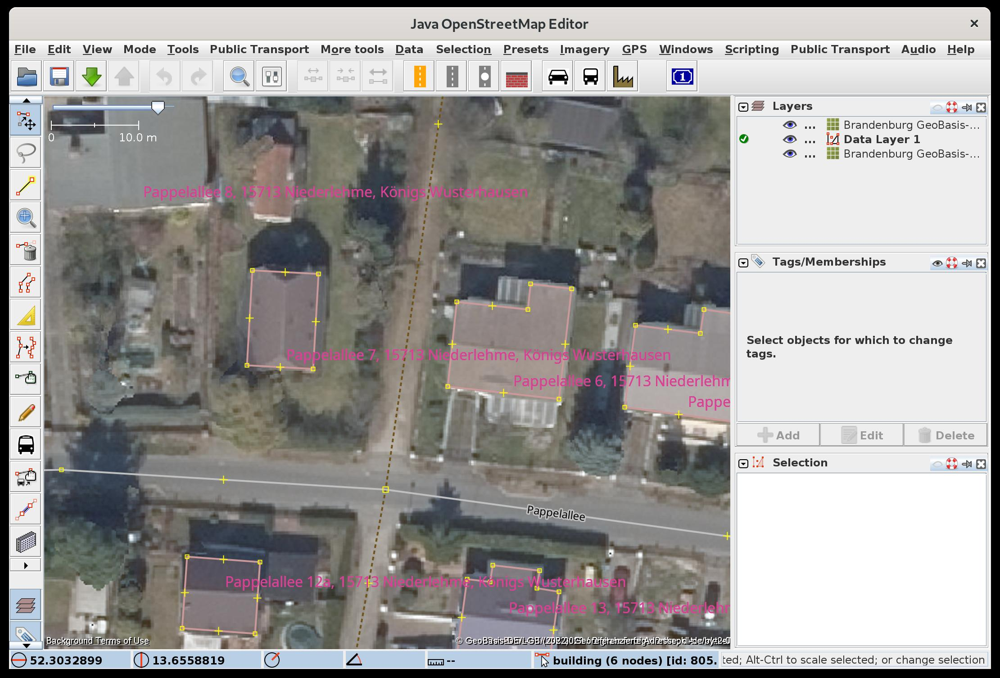

# Adressen in Brandenburg in OpenStreetMap

Dieses Projekt gleicht die offiziellen Adress-Daten (Hausnummern) des Landes
Brandenburg mit den Adressen in OpenStreetMap ab und hebt die Adressen hervor,
die in OpenStreetMap möglicherweise fehlen.

## Vorschau




## Hintergrund-Information

Die Geo-Basisdaten des Landes Brandenburg sind seit Ende 2019 als Open Data
unter der Lizenz „Datenlizenz Deutschland 2.0 Namensnennung
[dl/de/by-2.0](https://www.govdata.de/dl-de/by-2-0)“
freigegeben. Dazu gehören auch die
[Georeferenzierten Adressen (Hauskoordinaten)](https://geobasis-bb.de/lgb/de/geodaten/liegenschaftskataster/georeferenzierte-adresse/).
Seit April 2020 wurde die Verwendung für OpenStreetMap
[ermöglicht](https://wiki.openstreetmap.org/wiki/Brandenburg/Geoportal).

## Einbindung in JOSM

Dieses Projekt stellt die Georeferenzierten Adressen als Hintergrund-Layer für
den
[OpenStreetMap-Editor JOSM](https://josm.openstreetmap.de/)
zur Verfügung. Dabei werden die Adressen mit den Daten in OpenStreetMap
abgeglichen und diejenigen hervorgehoben, die in OpenStreetMap möglicherweise
fehlen.

### Übersicht auf größerem Maßstab

Auf niedrigem Zoomlevel bekommt man eine Übersicht, wo möglicherweise noch
Adressen in OpenStreetMap fehlen: Je roter desto mehr Adressen konnten nicht in
OSM gefunden werden.

### Einzelne Adressen als Punkte

Wenn man ein wenig hereinzoomt, werden die einzelnen Adresspunkte angezeigt und
eingefärbt: weiß = Übereinstimmung, pink = keine Übereinstimmung, blau =
Übereinstimmung, aber mehr als 75 m entfernt.

### Hausnummern

Vergrößert man die Karte bis auf die Ebene der Häuser werden die Hausnummern
eingeblendet. In dieser Ansicht kann man schnell Hausnummern hinzufügen, wenn
die Zuordnung zur Straße klar ist.

### Vollständige Adressen

Wenn man noch weiter hereinzoomt, werden die vollständigen Adressen mit Straße,
Postleitzahl, Ortsteil und Gemeinde eingeblendet. Dies ist hilfreich, um direkt
an diese Daten zu kommen, oder falls die Zuordnung zur Straße nicht klar ist.

